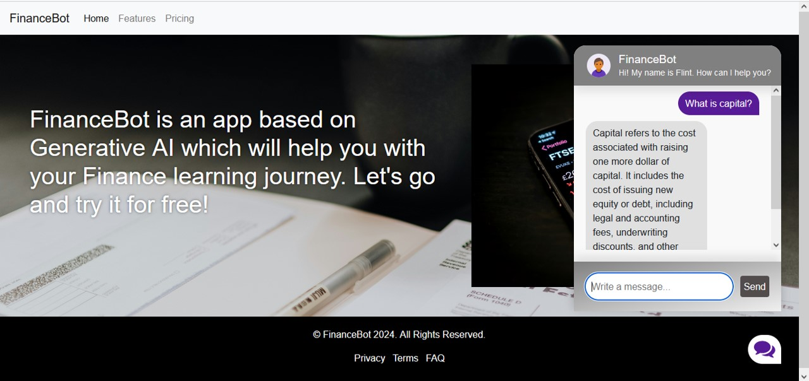

# Knowledge Base Chatbot

FinanceBot Knowledge Base Chatbot is a tool designed to provide instant access to financial information and expertise. Leveraging state-of-the-art natural language processing (NLP) algorithms, FinanceBot extracts valuable insights and knowledge from a comprehensive finance PDF resource, transforming it into an interactive chatbot experience. FinanceBot was built using Llama2 - 7B, Langchain, FAISS, and Flask as foundational technologies.

## Repository Structure
- [`README.md`](README.md): The file contais the description of the project.
- [`app.py`](app.py): Execute FinanceBot in a Flask server.
- [`model.py`](model.py): The file executes the chatbot instructions in order to generate a response according to user's input.
- [`ingest.py`](ingest.py): The file generates the vectorstore based on the pdf source.
- [`vectoresctore/db_faiss`](vectoresctore/db_faiss): Contains the vectostore database using FAISS.
- [`templates`](templates): The folder contains the html file of the interface application.
- [`static`](static): The folder contains css, js, and images files used in the application.
- [`data`](data): The folder contains the pdf used to create the knowledge base.

## Source
The pdf source used is 'The Basics of Finance An Introduction to Financial Markets, Business Finance, and Portfolio Management'.

## Future work
- Add features such a pdf loader.
- Increase the speed of answer.
- Increase the number of sources.